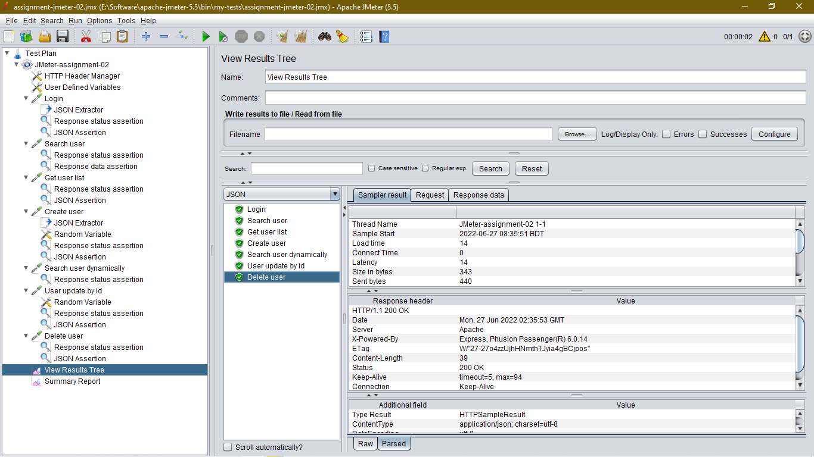
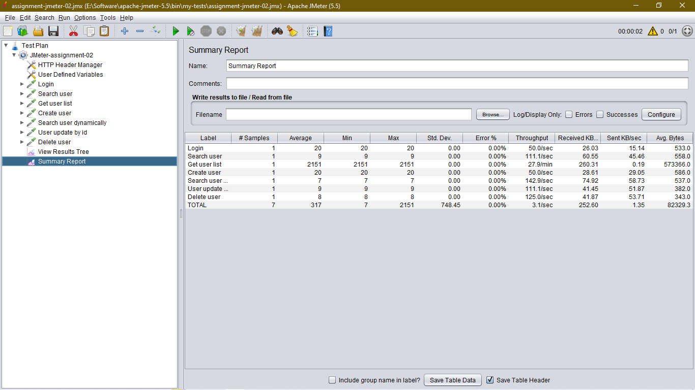
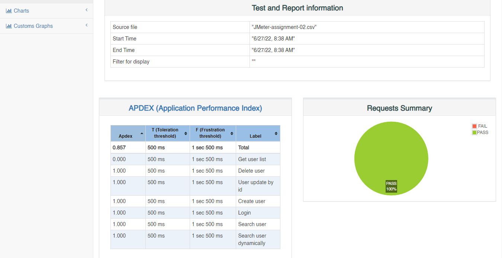
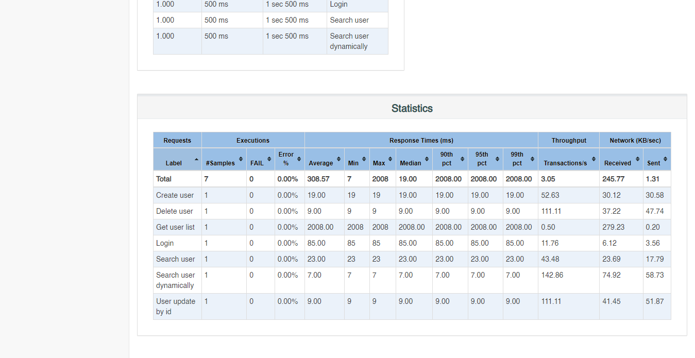

# API Testing using JMeter Project

## **Solved:**

- ### [Testing Server API](http://dmoney.professionaltrainingbd.com)

#### How to run this project

- #### Clone this project

```bash
https://github.com/mnomanme/APITestJMeter.git

cd APITestJMeter
```

- #### Move file into **\apache-jmeter-5.5\bin** this path

- #### Open in windows terminal or git bash terminal and run below command

```bash
- jmeter -n -t "JMeter-assignment-02.jmx" -l "JMeter-assignment-02.csv" -e -o Reports
```

#### Steps

- #### Create user

- #### Search User

- #### Update user by id specific property

- #### Delete user

#### API Test Strategy

- [Server](https://demoqa.com/BookStore/v1/Books)

- Results Tree

|  |
| :--------------------------------------------------: |
|              _Jmeter Test Collection 1_              |

- Summary Reports

|  |
| :--------------------------------------------------: |
|              _Jmeter Test Collection 2_              |

#### **JMeter Summary Report**

- Test Report Summary

|  |
| :-----------------------------------------: |
|                  _Summary_                  |

- Test Report Statistics

|  |
| :-----------------------------------------: |
|                _Statistics_                 |
